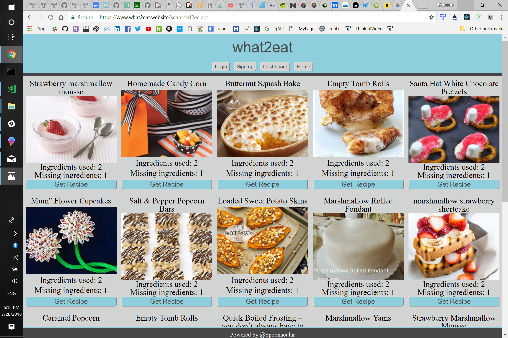

# what2eat

## Application details
- A recipe finder for the ingredients you do have.
- Navigating to the ** (Where to find page) will reveal a layout of a welcome page. You can make an account to get full features or continue on the the finder itself for quick access.
- Users can 
- Keeps 

## Where to find
You can search [HERE](https:///)!

## Instructions
 -
 - 
    - 
      
    - 
    
- 
- 
- 

## Coding styles

- *
- * 

## Screenshots

- On the left you will find what 
- Mobile screenshots on the left and right
- Middle screenshot is what it looks like on a full sized screen

  

## Contributions
Contributions to the application are accepted. If you have a design suggestion, feel free to 
change and make a pull request. I styled this app with the simplest of styles.

## Built With

* [React](https://github.com/gitname/react-gh-pages) - The web framework used
- [Redux: Usage with React](https://redux.js.org/basics/usage-with-react) - State management
* [Enzyme](https://airbnb.io/enzyme/) - Testing framework
* [JWT-decode](https://www.npmjs.com/package/jwt-decode) - Verification

## Authors

* **Dameon Mendoza** - *Initial work* - [dameon1](https://github.com/dameon1)

## License

This project is licensed under the MIT License - see the [LICENSE.md](LICENSE.md) file for details

## Acknowledgments

(https://spoonacular.com/)
(https://www.thinkful.com/)

